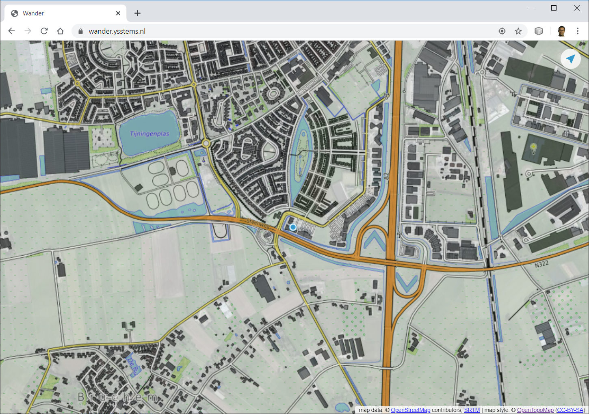

# wander
Wander is a global hiking map, featuring [Opentopomap](https://opentopomap.org/about)
with all the [OSM](https://www.openstreetmap.org) footpaths,
on top of [Mapbox satellite](https://www.mapbox.com/maps/satellite/) images for detailed context.

Follow these steps to get started:

1. Create an account with [Mapbox](https://www.mapbox.com/). You get [200,000](https://www.mapbox.com/pricing/#gltile) satellite map tiles for free each month.
1. Create a "public" `access_token` in your Mapbox account. Keep it secret to ensure you stay under your monthly limit.
1. Go to [wander](https://wander.ysstems.nl).
1. On mobile, choose "share" to save it as an app on the home screen, and launch it from there.
1. Paste your `access_token` when prompted (just once).
1. Hike around. Keep an eye on your [tile usage](https://account.mapbox.com/).

Note that though images will be cached on your device, the map is an online application.
You might want to take some screen shots before you head out.
